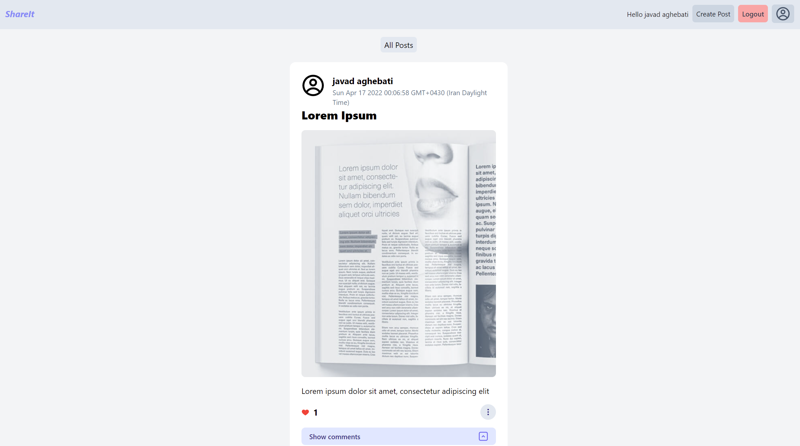

# shareit-mern

social media clone using MERN stack

###Screenshot


## Getting started

These instructions will help you run this project on on your local machine for development and testing purposes

run your server on port 3002 or change server address on line 83 in Post.js file .

```
npm start
```

on both frontend and backend

## Future Updates

- [x] Follow and Unfollow

## Built With

React

Redux toolkit

Tailwind CSS

Expressjs

Nodejs

Mongodb

Multer
